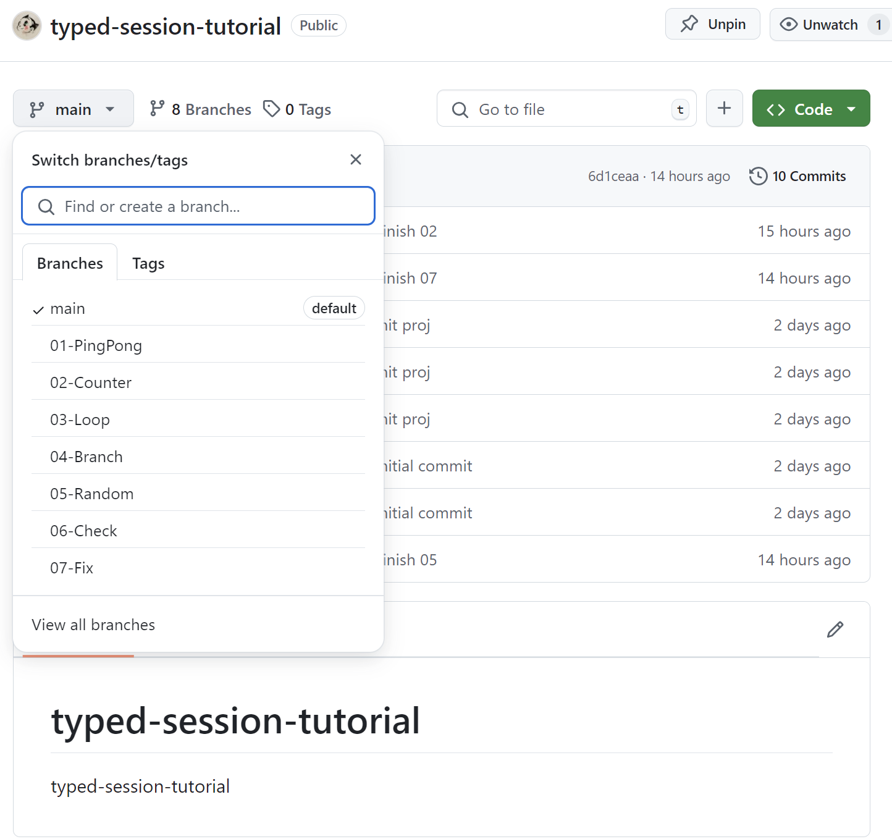
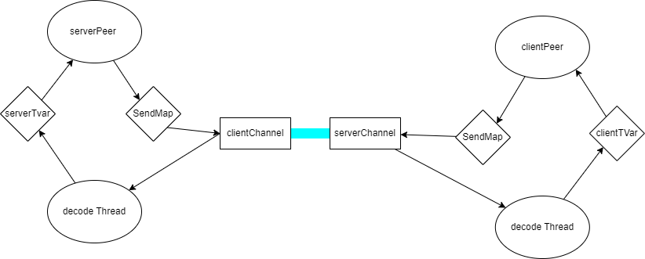
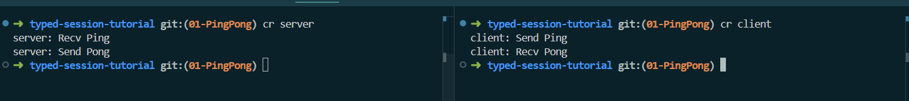

# 01-PingPong

typed-session 是一个通信协议框架，它能静态检查通信语义的正确性。

typed-session 将通信过程看成一个状态机，每一次通信将改变状态机的状态，在类型上跟踪这些状态的变化，便能检查通信的正确性。

typed-session 受到typed-protocols的启发而创建，与它不同的是typed-session 将状态隐藏在幕后，尽量减少状态的泄露。

通信过程需要为不确定状态建模，而这正是Mcbride Indexed Monad 所做的。为了使用do语法来描述通信内容需要使用QualifiedDo 语法扩展。在GHC 9.10.1之前的版本 QualifiedDo 存在Bug，因此typed-session 要求GHC 版本9.10.1 或以上。

这个文档将详细介绍typed-session的用法。每一章都会通过具体的例子来解释typed-session的用法。每个章节的代码都可以在[typed-session-tutorial](https://github.com/sdzx-1/typed-session-tutorial)对应的分支中找到。


## 让我们开始第一个例子PingPong

PingPong是一个简单的通信协议，它包含两个角色Client,Server。它的通信过程非常简单，Client向Server发送一个Ping消息，Server返回一个Pong消息。

如此简单的协议，在typed-session中实现起来非常简单，分下面4步：

### 1.定义需要的类型
首先创建Type.hs文件，在里面定义一些需要的类型和函数：

定义角色类型
```haskell
data PingPongRole = Client | Server
  deriving (Show, Eq, Ord, Enum, Bounded)
```
定义角色类型是非常有必要的。typed-session支持多角色通信协议，将角色类型化能方便添加或者删除角色。注意这里deriving 部分是必须的，在接下来解析协议，生成状态机状态时会用到。目前typed-session 的template代码生成部分还不支持含有变量的角色类型。

定义分支状态
```haskell
data PingPongBranchSt = PingPongBranchSt
  deriving (Show, Eq, Ord, Enum, Bounded)
```
分支状态被用于指明当前通信过程处于哪个分支。在本例中将不会使用分支状态，因此定义一个简单的分支状态。注意这里deriving 部分是必须的，在接下来解析协议，生成状态机状态时会用到。同角色类型一样分支状态不支持含有类型变量。

定义解析和生成函数
```haskell
pingpongProtocol :: QuasiQuoter
pingpongProtocol =
  protocol
    @PingPongRole
    @PingPongBranchSt
    "PingPong"
    ''PingPongRole
    ''PingPongBranchSt
```
我使用QuasiQuoter 在编译时生成代码，语义template-hasekll 的编译阶段限制，这里需要将pingpongProtocol 函数的定义与使用分开到两个文件。这里需向protocol 函数传递的参数依次是：
- @PingPongRole  通过 {-# LANGUAGE TypeApplications #-} 扩展可以使用类型变量来传递类型参数，这里时角色的类型
- @PingPongBranchSt  同上，这里时分支状态的类型
- "PingPong"  通信协议的名字，状态机的类型
- ''PingPongRole 角色类型的Name，主要用于生成代码, 这里需要使用扩展{-# LANGUAGE TemplateHaskellQuotes #-}
- ''PingPongBranchSt 分支状态类型的Name，主要用于生成代码


### 2.定义通信协议
创建 Protocol.hs 文件，在里面定义通信协议以及相关的类型及函数。

定义通信协议

```haskell
[pingpongProtocol|

Msg Ping [] Client Server
Msg Pong [] Server Client
Terminal

|]
```
这里需要QuasiQuoter 扩展，pingpongProtocl 就是Type.hs中定义的pingpongProtocol 函数。这里将生成一系列的代码。

给Msg 每个位置一个编号，方便后续使用。
```
Msg Ping [] Client Server
1   2    3  4      5
```
1. Msg 表示定义一条消息，Terminal 整个协议结束。
2. Ping 是消息的名字，它最终将会生成一个同名的构造器，所以首字符需要大写，并且消息的名字不能相同。
3. [] 表示消息的参数，这里没有参数，因此为空。
4. Client 表示消息的发送方，这里必须是我们在Type.hs中定义的角色类型。
5. Server 表示消息的接收方，这里必须是我们在Type.hs中定义的角色类型。

那么我们翻译一下上面的协议：Client 发送一个Ping消息，Server 返回一个Pong消息，然后通信结束。
这里的Termianl 表示通信结束。

--------------------------
上面protocol的定义将在幕后生成的下面的代码:
```haskell
data SPingPongRole (a_a9pv :: PingPongRole)
  where
    SClient :: SPingPongRole 'Client
    SServer :: SPingPongRole 'Server
type instance Data.IFunctor.Sing = SPingPongRole
instance Data.IFunctor.SingI 'Client where
  Data.IFunctor.sing = SClient
instance Data.IFunctor.SingI 'Server where
  Data.IFunctor.sing = SServer
instance SingToInt PingPongRole where
  singToInt x_a9pw
    = ghc-prim:GHC.Types.I# (ghc-prim:GHC.Magic.dataToTag# x_a9pw)
data PingPong = End | S0 | S1
data SPingPong (a_a9py :: PingPong)
  where
    SEnd :: SPingPong 'End
    SS0 :: SPingPong 'S0
    SS1 :: SPingPong 'S1
type instance Data.IFunctor.Sing = SPingPong
instance Data.IFunctor.SingI 'End where
  Data.IFunctor.sing = SEnd
instance Data.IFunctor.SingI 'S0 where
  Data.IFunctor.sing = SS0
instance Data.IFunctor.SingI 'S1 where
  Data.IFunctor.sing = SS1
instance SingToInt PingPong where
  singToInt x_a9pB
    = ghc-prim:GHC.Types.I# (ghc-prim:GHC.Magic.dataToTag# x_a9pB)
instance Protocol PingPongRole PingPong where
  type Done 'Client = 'End
  type Done 'Server = 'End
  data forall (from_a9pD :: PingPong)
              (send_a9pE :: PingPongRole)
              (sendNewSt_a9pF :: PingPong)
              (recv_a9pG :: PingPongRole)
              (receiverNewSt_a9pH :: PingPong). Msg PingPongRole PingPong (from_a9pD :: PingPong) (send_a9pE :: PingPongRole) (sendNewSt_a9pF :: PingPong) (recv_a9pG :: PingPongRole) (receiverNewSt_a9pH :: PingPong)
    where
      Ping :: Msg PingPongRole PingPong 'S0 'Client 'S1 'Server 'S1
      Pong :: Msg PingPongRole PingPong 'S1 'Server 'End 'Client 'End
```
让我来详细解释这些生成代码：

```haskell
data SPingPongRole (a_a9pv :: PingPongRole)
  where
    SClient :: SPingPongRole 'Client
    SServer :: SPingPongRole 'Server
```
PingPongRole 的singleton代码

```haskell
type instance Data.IFunctor.Sing = SPingPongRole
instance Data.IFunctor.SingI 'Client where
  Data.IFunctor.sing = SClient
instance Data.IFunctor.SingI 'Server where
  Data.IFunctor.sing = SServer
```
关于SPingPongRole 的Sing，SingI的实现

```haskell
instance SingToInt PingPongRole where
  singToInt x_a9pw
    = ghc-prim:GHC.Types.I# (ghc-prim:GHC.Magic.dataToTag# x_a9pw)
```
这个类型实现的代码是：如何将SPingPongRole 的构造器 SSClient，SServer 转换为Int。typed-session支持多角色通信，发送消息时需要查找对应角色的发送函数，将角色转化为Int，并将它与发送函数存储在IntMap中。这里使用dataToTag# 函数将构造器转换为Int。

```haskell
data PingPong = End | S0 | S1
```
在Type.hs中定义pingpongProtocl 时传递的String "PingPong" 最终将生成这里类型PingPong。它代表了状态机所有可能的状态。状态生成的具体算法是由库[typed-session-state-algorithm](https://github.com/sdzx-1/typed-session-state-algorithm)实现。

```haskell
data SPingPong (a_a9py :: PingPong)
  where
    SEnd :: SPingPong 'End
    SS0 :: SPingPong 'S0
    SS1 :: SPingPong 'S1
type instance Data.IFunctor.Sing = SPingPong
instance Data.IFunctor.SingI 'End where
  Data.IFunctor.sing = SEnd
instance Data.IFunctor.SingI 'S0 where
  Data.IFunctor.sing = SS0
instance Data.IFunctor.SingI 'S1 where
  Data.IFunctor.sing = SS1
```
关于PingPong 的singleton代码,以及SPingPong的Sing，SingI 实现。

```haskell
instance SingToInt PingPong where
  singToInt x_a9pB
    = ghc-prim:GHC.Types.I# (ghc-prim:GHC.Magic.dataToTag# x_a9pB)
```
与前面pingpongRole 一样，将SPingPong 的构造器转换为Int。

```haskell
instance Protocol PingPongRole PingPong where
  type Done 'Client = 'End
  type Done 'Server = 'End
  data forall (from_a9pD :: PingPong)
              (send_a9pE :: PingPongRole)
              (sendNewSt_a9pF :: PingPong)
              (recv_a9pG :: PingPongRole)
              (receiverNewSt_a9pH :: PingPong). Msg PingPongRole PingPong (from_a9pD :: PingPong) (send_a9pE :: PingPongRole) (sendNewSt_a9pF :: PingPong) (recv_a9pG :: PingPongRole) (receiverNewSt_a9pH :: PingPong)
    where
      Ping :: Msg PingPongRole PingPong 'S0 'Client 'S1 'Server 'S1
      Pong :: Msg PingPongRole PingPong 'S1 'Server 'End 'Client 'End
```
这是协议的核心，实现Protocol 类的定义。
Protocol 的定义如下：
```haskell
class (SingToInt role', SingToInt ps) => Protocol role' ps where
  type Done (sr :: role') :: ps
  data
    Msg
      role'
      ps
      (fromSt :: ps)
      (sender :: role')
      (senderNewSt :: ps)
      (receiver :: role')
      (receiverNewSt :: ps)
```

详细解析data Msg的构造器 Ping：
```
  Ping :: Msg PingPongRole PingPong 'S0 'Client 'S1 'Server 'S1
  1           2            3         4   5       6   7       8
```
1. Ping 正如上面所说，这里将协议描述里Ping生成了构造器Ping。
2. PingPongRole 角色类型
3. PingPong 协议状态机的类型
4. 'S0 发送消息时发送者和接收者都必须处于相同状态S0
5. 'Client 发送者的角色
6. 'S1 发送者发送消息后处于的新状态
7. 'Server 接收者的角色
8. 'S1 接收者接收消息后处于的新状态

----------------------

在生成代码的同时也将生成一个PingPong.prot 文件，里面包含状态机的具体描述。
PingPong.prot 文件内容如下：
```
-------------Client-----Server-----
  Ping []    Send (S0)  Recv (S0)  
  Pong []    Recv (S1)  Send (S1)  
  Terminal        (End)      (End) 
```

如果你感兴趣生成的代码可以使用{-# OPTIONS_GHC -ddump-splices #-} 打印生成代码。

-----------------
接下来需要做些编解码工作。

```haskell
data AnyMsg role' ps where
  AnyMsg
    :: ( SingI recv
       , SingI st
       , SingToInt role'
       , SingToInt ps
       )
    => Msg role' ps st send st' recv st''
    -> AnyMsg role' ps

instance Show (AnyMsg PingPongRole PingPong) where
  show (AnyMsg msg) = case msg of
    Ping -> "Ping"
    Pong -> "Pong"
```
AnyMsg是Msg的一个包装器，隐藏Msg的一部分信息，一般用于编解码。

```haskell
newtype Encode role' ps bytes = Encode
  { encode
      :: forall (send :: role') (recv :: role') (st :: ps) (st' :: ps) (st'' :: ps)
       . Msg role' ps st send st' recv st''
      -> bytes
  }
encodeMsg :: Encode PingPongRole PingPong L.ByteString
encodeMsg = Encode $ \x -> runPut $ case x of
  Ping -> putWord8 0
  Pong -> putWord8 1

```
质朴的编码函数。

```haskell
getAnyMsg :: Get (AnyMsg PingPongRole PingPong)
getAnyMsg = do
  tag <- getWord8
  case tag of
    0 -> return $ AnyMsg Ping
    1 -> return $ AnyMsg Pong
    _ -> fail "Invalid message tag"
```
质朴的解码函数。

```haskell
decodeMsg
  :: DecodeStep
      L.ByteString
      CodecFailure
      (AnyMsg PingPongRole PingPong)
decodeMsg = convertDecoderLBS (runGetIncremental getAnyMsg)
```
runGetIncremental 表示使用增量解码，convertDecoderLBS 将binary库的Decoder 转换为typed-session的DecodeStep。

这里编解码使用binary库。


接下来需要为通信做些准备工作，虽然代码有些繁琐，但他们都是固定的代码仅需要写一次。

```haskell
convertDecoderLBS
  :: Decoder a
  -> (DecodeStep L.ByteString CodecFailure a)
convertDecoderLBS = go
 where
  go :: Decoder a -> DecodeStep L.ByteString CodecFailure a
  go (Done tr _ a) = DecodeDone a (Just $ L.fromStrict tr)
  go (Fail _ _ e) = DecodeFail (CodecFailure e)
  go (Partial k) = DecodePartial $ \mbs -> case mbs of
    Nothing -> DecodeFail (CodecFailure "Peer disconnected!!")
    Just bs -> go (k $ Just $ L.toStrict bs)
```
将binary库的Decoder 转换为typed-session的DecodeStep。注意这里的Decoder 具有的增量解码的含义。


```haskell
socketAsChannel :: Socket.Socket -> Channel IO L.ByteString
socketAsChannel socket =
  Channel{send, recv}
 where
  send :: L.ByteString -> IO ()
  send chunks = do
    Socket.sendMany socket (L.toChunks chunks)

  recv :: IO (Maybe L.ByteString)
  recv = do
    chunk <- Socket.recv socket L.smallChunkSize
    if BS.null chunk
      then return Nothing
      else return (Just (L.fromStrict chunk))
```
将socket 转换为typed-session的Channel。

```haskell
myTracer :: String -> Tracer PingPongRole PingPong IO
myTracer st v = putStrLn (st <> show v)
```
定义一个tracer，用于在控制台打印通信消息。

### 3.实现通信过程
创建 Peer.hs 文件，在里面实现通信过程。

实现client通信逻辑

```haskell
clientPeer :: Peer PingPongRole PingPong Client IO (At () (Done Client)) S0
clientPeer = I.do
  yield Ping
  Pong <- await
  returnAt ()
```
给它的类型加上编号一一说明：
```
Peer PingPongRole PingPong Client IO (At () (Done Client)) S0
1    2            3        4      5  6                     7
```
1. Peer 是一个数据类型，通信行为的抽象，我们所做的一切就是构建它，然后解释它。
2. PingPongRole 角色类型
3. PingPong 协议类型
4. Client 具体角色 
5. IO 内部monad 的类型
6. At () (Done Client) （Done Client）表示通信结束时候的状态
7. S0 表示通信开始的状态, 这里是为数不多泄露状态的地方，参考PingPong.prot 得知client 开始时状态为S0。

`I.do` 即使表示使用QualifiedDo 语法，这里的`I`表示 
```haskell
import qualified Data.IFunctor as I
```

yield 表示发送一个消息, await 表示接收一个消息。
```haskell
  Pong <- await
```

实现server通信逻辑

```haskell
serverPeer :: Peer PingPongRole PingPong Server IO (At () (Done Server)) S0
serverPeer = I.do
  Ping <- await
  yield Pong
  returnAt ()
```
与client 类似，注意通信细节的变化。

### 4.启动通信

结构示意如下：


下面是server 的启动代码。
```haskell
runTCPServer :: IO ()
runTCPServer = runTCPServer' Nothing "3000"

runTCPServer' :: Maybe HostName -> ServiceName -> IO ()
runTCPServer' mhost port = withSocketsDo $ do
  addr <- resolve
  E.bracket (open addr) close start
 where
  resolve = do
    let hints =
          defaultHints
            { addrFlags = [AI_PASSIVE]
            , addrSocketType = Stream
            }
    head <$> getAddrInfo (Just hints) mhost (Just port)

  open addr = E.bracketOnError (openSocket addr) close $ \sock -> do
    setSocketOption sock ReuseAddr 1
    withFdSocket sock setCloseOnExecIfNeeded
    bind sock $ addrAddress addr
    listen sock 1024
    return sock

  start sock = do
    (client, _peer) <- accept sock
    serverTvar <- newTVarIO IntMap.empty
    let clientChannel = socketAsChannel client
    thid1 <- forkIO $ decodeLoop (myTracer "server: ") Nothing (Decode decodeMsg) clientChannel serverTvar

    let sendMap = IntMap.fromList [(singToInt SClient, C.send clientChannel)]
        serverDriver = driverSimple (myTracer "server: ") encodeMsg sendMap serverTvar id
    void $ runPeerWithDriver serverDriver serverPeer
    killThread thid1
    close client
```
通过socketAtChannel 将socket 转换为Channel，同时创建serverTvar，通过forkIO 启动解码进程decodeLoop。decodeLoop 循环执行：从Channel中读取数据，使用decodeMsg增量解码，将解码的消息放入serverTvar 中。
因为typed-session 允许多角色通信，在发送消息时需要指定使用哪一个接收者的Channel。所以这里使用sendMap，将角色与发送函数对应形成sendMap，发送消息时从sendMap中查询对应的发送函数。


client 的启动代码与server类似。

```haskell
getSocket :: HostName -> ServiceName -> IO Socket
getSocket host port = do
  addr <- resolve
  open addr
 where
  resolve = do
    let hints = defaultHints{addrSocketType = Stream}
    head <$> getAddrInfo (Just hints) (Just host) (Just port)

  open addr = E.bracketOnError (openSocket addr) close $ \sock -> do
    connect sock $ addrAddress addr
    return sock

runTCPClient :: IO ()
runTCPClient = withSocketsDo $ do
  E.bracket
    ( do
        serverSock <- getSocket "127.0.0.1" "3000"
        pure serverSock
    )
    (\a -> close a)
    client
 where
  client serverSock = do
    clientTvar <- newTVarIO IntMap.empty
    let serverChannel = socketAsChannel serverSock
        sendMap = IntMap.fromList [(singToInt SServer, C.send serverChannel)]
        clientDriver = driverSimple (myTracer "client: ") encodeMsg sendMap clientTvar id
    thid1 <- forkIO $ decodeLoop (myTracer "client: ") Nothing (Decode decodeMsg) serverChannel clientTvar
    void $ runPeerWithDriver clientDriver clientPeer
    killThread thid1
```

## 5.总结
以上就是使用typed-session 实现一个PingPong 协议的全部代码。
你可以通过 cabal run server, cabal run client 来测试代码。
运行结果如下


typed-session 用起来并不是一件容易的事，它涉及很多的概念，很多代码。将整个体系建立起来总是比较困难的，但是别担心，最困难的时候已经过去了，后面文章的例子都是在PingPong的基础上逐步完善，添加更多的功能，这将比建立体系容易很多。