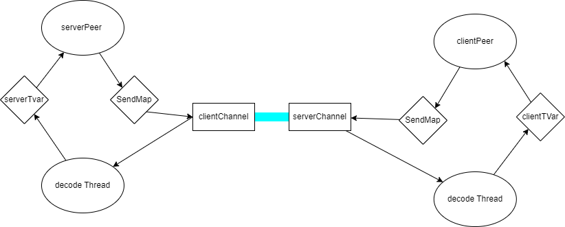

# 01-PingPong

The [typed-session](https://github.com/sdzx-1/typed-session) is a communication protocol framework that can statically check the correctness of communication semantics.

The typed-session regards the communication process as a state machine. Each communication will change the state of the state machine. By tracking these state changes in type, the correctness of communication can be checked.

The typed-session was inspired by typed-protocols. Unlike it, typed-session hides the state behind the scenes to minimize state leakage.

The communication process needs to model uncertain states, which is what [Mcbride Indexed Monad](https://stackoverflow.com/questions/28690448/what-is-indexed-monad) does. In order to use the do syntax to describe the communication content, the QualifiedDo syntax extension is required. There is a bug in QualifiedDo before GHC 9.10.1, so typed-session requires GHC version 9.10.1 or above.

This document will introduce the usage of typed-session in detail. Each chapter will explain the usage of typed-session through specific examples. The code for each chapter can be found in the corresponding branch of [typed-session-tutorial](https://github.com/sdzx-1/typed-session-tutorial).


## Let's start with the first example PingPong

PingPong is a simple communication protocol that includes two roles, Client and Server. Its communication process is very simple. The Client sends a Ping message to the Server, and the Server returns a Pong message.

Such a simple protocol is very easy to implement in typed-session, which is divided into the following 4 steps:

### 1. Define the required types
First, create the Type.hs file and define some required types and functions in it:

Define the role type
```haskell
data PingPongRole = Client | Server
  deriving (Show, Eq, Ord, Enum, Bounded)
```
It is very necessary to define the role type. typed-session supports multi-role communication protocols. Typing roles can facilitate adding or deleting roles. Note that the deriving part is required and will be used when parsing the protocol and generating state machine states. Currently, the template code generation part of typed-session does not support role types with variables.

Define branch state
```haskell
data PingPongBranchSt = PingPongBranchSt
  deriving (Show, Eq, Ord, Enum, Bounded)
```
The branch state is used to indicate which branch the current communication process is in. In this example, the branch state will not be used, so a simple branch state is defined. Note that the deriving part is required here, and it will be used when parsing the protocol and generating the state machine state. Like the role type, the branch state does not support type variables.

Define parsing and generation functions
```haskell
pingpongProtocol :: QuasiQuoter
pingpongProtocol =
  protocol
    @PingPongRole
    @PingPongBranchSt
    "PingPong"
    ''PingPongRole
    ''PingPongBranchSt
```
I use QuasiQuoter to generate code at compile time. The compilation phase of semantic template-hasekll limits that the definition and use of the pingpongProtocol function need to be separated into two files. The parameters that need to be passed to the protocol function are: 
- @PingPongRole can use type variables to pass type parameters through the {-# LANGUAGE TypeApplications #-} extension, which is the type of the role. 
- @PingPongBranchSt Same as above, which is the type of the branch state. 
- "PingPong" The name of the communication protocol, the type of the state machine. 
- ''PingPongRole The Name of the role type, mainly used to generate code, here you need to use the extension {-# LANGUAGE TemplateHaskellQuotes #-}. 
- ''PingPongBranchSt The Name of the branch state type, mainly used to generate code.

### 2. Define the communication protocol
Create the Protocol.hs file and define the communication protocol and related types and functions in it.

Define the communication protocol

```haskell
[pingpongProtocol|

Msg Ping [] Client Server
Msg Pong [] Server Client
Terminal

|]
```
Here, QuasiQuoter extension is needed, and pingpongProtocl is the pingpongProtocol function defined in Type.hs. A series of codes will be generated here.

Give each position of Msg a number for subsequent use.
```
Msg Ping [] Client Server
1   2    3  4      5
```
1. Msg means defining a message, and Terminal means the whole protocol ends.
2. Ping is the name of the message, which will eventually generate a constructor with the same name, so the first character needs to be capitalized, and the message names cannot be the same.
3. [] means the parameters of the message, and there are no parameters here, so it is empty.
4. Client means the sender of the message, which must be the role type defined in Type.hs.
5. Server means the receiver of the message, which must be the role type defined in Type.hs.

Then let's translate the above protocol: Client sends a Ping message, Server returns a Pong message, and then the communication ends.
Termianl here means the end of communication.

--------------------------
The above protocol definition will generate the following code behind the scenes:

```haskell
data SPingPongRole (a_a9pv :: PingPongRole)
  where
    SClient :: SPingPongRole 'Client
    SServer :: SPingPongRole 'Server
type instance Data.IFunctor.Sing = SPingPongRole
instance Data.IFunctor.SingI 'Client where
  Data.IFunctor.sing = SClient
instance Data.IFunctor.SingI 'Server where
  Data.IFunctor.sing = SServer
instance SingToInt PingPongRole where
  singToInt x_a9pw
    = ghc-prim:GHC.Types.I# (ghc-prim:GHC.Magic.dataToTag# x_a9pw)
data PingPong = End | S0 | S1
data SPingPong (a_a9py :: PingPong)
  where
    SEnd :: SPingPong 'End
    SS0 :: SPingPong 'S0
    SS1 :: SPingPong 'S1
type instance Data.IFunctor.Sing = SPingPong
instance Data.IFunctor.SingI 'End where
  Data.IFunctor.sing = SEnd
instance Data.IFunctor.SingI 'S0 where
  Data.IFunctor.sing = SS0
instance Data.IFunctor.SingI 'S1 where
  Data.IFunctor.sing = SS1
instance SingToInt PingPong where
  singToInt x_a9pB
    = ghc-prim:GHC.Types.I# (ghc-prim:GHC.Magic.dataToTag# x_a9pB)
instance Protocol PingPongRole PingPong where
  type Done 'Client = 'End
  type Done 'Server = 'End
  data forall (from_a9pD :: PingPong)
              (send_a9pE :: PingPongRole)
              (sendNewSt_a9pF :: PingPong)
              (recv_a9pG :: PingPongRole)
              (receiverNewSt_a9pH :: PingPong). Msg PingPongRole PingPong (from_a9pD :: PingPong) (send_a9pE :: PingPongRole) (sendNewSt_a9pF :: PingPong) (recv_a9pG :: PingPongRole) (receiverNewSt_a9pH :: PingPong)
    where
      Ping :: Msg PingPongRole PingPong 'S0 'Client 'S1 'Server 'S1
      Pong :: Msg PingPongRole PingPong 'S1 'Server 'End 'Client 'End
```
Let me explain these generated codes in detail:

```haskell
data SPingPongRole (a_a9pv :: PingPongRole)
  where
    SClient :: SPingPongRole 'Client
    SServer :: SPingPongRole 'Server
```
PingPongRole singleton code.

```haskell
type instance Data.IFunctor.Sing = SPingPongRole
instance Data.IFunctor.SingI 'Client where
  Data.IFunctor.sing = SClient
instance Data.IFunctor.SingI 'Server where
  Data.IFunctor.sing = SServer
```
About the implementation of Sing and SingI of SPingPongRole.

```haskell
instance SingToInt PingPongRole where
  singToInt x_a9pw
    = ghc-prim:GHC.Types.I# (ghc-prim:GHC.Magic.dataToTag# x_a9pw)
```

The code implemented by this type class is: how to convert the constructors SSClient and SServer of SPingPongRole to Int. Typed-session supports multi-role communication. When sending a message, you need to find the send function of the corresponding role, convert the role to Int, and store it and the send function in IntMap. Here, the dataToTag# function is used to convert the constructor to Int.

```haskell
data PingPong = End | S0 | S1
```
The String "PingPong" passed when defining pingpongProtocl in Type.hs will eventually generate this type PingPong. It represents all possible states of the state machine. The specific algorithm for state generation is implemented by the library [typed-session-state-algorithm](https://github.com/sdzx-1/typed-session-state-algorithm).

```haskell
data SPingPong (a_a9py :: PingPong)
  where
    SEnd :: SPingPong 'End
    SS0 :: SPingPong 'S0
    SS1 :: SPingPong 'S1
type instance Data.IFunctor.Sing = SPingPong
instance Data.IFunctor.SingI 'End where
  Data.IFunctor.sing = SEnd
instance Data.IFunctor.SingI 'S0 where
  Data.IFunctor.sing = SS0
instance Data.IFunctor.SingI 'S1 where
  Data.IFunctor.sing = SS1
```
About the singleton code of PingPong, and the Sing and SingI implementations of PingPong.

```haskell
instance SingToInt PingPong where
  singToInt x_a9pB
    = ghc-prim:GHC.Types.I# (ghc-prim:GHC.Magic.dataToTag# x_a9pB)
```
As with pingpongRole above, convert the SPingPong constructor to an Int.

```haskell
instance Protocol PingPongRole PingPong where
  type Done 'Client = 'End
  type Done 'Server = 'End
  data forall (from_a9pD :: PingPong)
              (send_a9pE :: PingPongRole)
              (sendNewSt_a9pF :: PingPong)
              (recv_a9pG :: PingPongRole)
              (receiverNewSt_a9pH :: PingPong). Msg PingPongRole PingPong (from_a9pD :: PingPong) (send_a9pE :: PingPongRole) (sendNewSt_a9pF :: PingPong) (recv_a9pG :: PingPongRole) (receiverNewSt_a9pH :: PingPong)
    where
      Ping :: Msg PingPongRole PingPong 'S0 'Client 'S1 'Server 'S1
      Pong :: Msg PingPongRole PingPong 'S1 'Server 'End 'Client 'End
```

This is the core of the protocol, which implements the definition of the Protocol class.
The definition of Protocol is as follows:

```haskell
class (SingToInt role', SingToInt ps) => Protocol role' ps where
  type Done (sr :: role') :: ps
  data
    Msg
      role'
      ps
      (fromSt :: ps)
      (sender :: role')
      (senderNewSt :: ps)
      (receiver :: role')
      (receiverNewSt :: ps)
```

Detailed analysis of the data Msg constructor Ping:
```
  Ping :: Msg PingPongRole PingPong 'S0 'Client 'S1 'Server 'S1
  1           2            3         4   5       6   7       8
```
1. Ping As mentioned above, here Ping in the protocol description is generated into the constructor Ping.
2. PingPongRole Role type
3. PingPong protocol state machine type
4. 'S0 When sending a message, both the sender and the receiver must be in the same state S0
5. 'Client The role of the sender
6. 'S1 The new state of the sender after sending the message
7. 'Server The role of the receiver
8. 'S1 The new state of the receiver after receiving the message


----------------------

When the code is generated, a PingPong.prot file will also be generated, which contains a detailed description of the state machine.
The contents of the PingPong.prot file are as follows:

```
-------------Client-----Server-----
  Ping []    Send (S0)  Recv (S0)  
  Pong []    Recv (S1)  Send (S1)  
  Terminal        (End)      (End) 
```
If you are interested in the generated code you can use {-# OPTIONS_GHC -ddump-splices #-} to print the generated code.

-----------------
Next we need to do some encoding and decoding.

```haskell
data AnyMsg role' ps where
  AnyMsg
    :: ( SingI recv
       , SingI st
       , SingToInt role'
       , SingToInt ps
       )
    => Msg role' ps st send st' recv st''
    -> AnyMsg role' ps

instance Show (AnyMsg PingPongRole PingPong) where
  show (AnyMsg msg) = case msg of
    Ping -> "Ping"
    Pong -> "Pong"
```
AnyMsg is a wrapper of Msg, hiding part of the information of Msg, and is generally used for encoding and decoding.

```haskell
newtype Encode role' ps bytes = Encode
  { encode
      :: forall (send :: role') (recv :: role') (st :: ps) (st' :: ps) (st'' :: ps)
       . Msg role' ps st send st' recv st''
      -> bytes
  }
encodeMsg :: Encode PingPongRole PingPong L.ByteString
encodeMsg = Encode $ \x -> runPut $ case x of
  Ping -> putWord8 0
  Pong -> putWord8 1

```
A simple encoding function.

```haskell
getAnyMsg :: Get (AnyMsg PingPongRole PingPong)
getAnyMsg = do
  tag <- getWord8
  case tag of
    0 -> return $ AnyMsg Ping
    1 -> return $ AnyMsg Pong
    _ -> fail "Invalid message tag"
```
Simple decoding function.

```haskell
decodeMsg
  :: DecodeStep
      L.ByteString
      CodecFailure
      (AnyMsg PingPongRole PingPong)
decodeMsg = convertDecoderLBS (runGetIncremental getAnyMsg)
```
runGetIncremental means using incremental decoding, and convertDecoderLBS converts the Decoder of the binary library to the DecodeStep of typed-session.

Here, the encoding and decoding uses the binary library.

Next, we need to do some preparation for communication. Although the code is a bit cumbersome, they are all fixed codes that only need to be written once.

```haskell
convertDecoderLBS
  :: Decoder a
  -> (DecodeStep L.ByteString CodecFailure a)
convertDecoderLBS = go
 where
  go :: Decoder a -> DecodeStep L.ByteString CodecFailure a
  go (Done tr _ a) = DecodeDone a (Just $ L.fromStrict tr)
  go (Fail _ _ e) = DecodeFail (CodecFailure e)
  go (Partial k) = DecodePartial $ \mbs -> case mbs of
    Nothing -> DecodeFail (CodecFailure "Peer disconnected!!")
    Just bs -> go (k $ Just $ L.toStrict bs)
```
Convert the binary library's Decoder to typed-session's DecodeStep. Note that the Decoder here has the meaning of incremental decoding.

```haskell
socketAsChannel :: Socket.Socket -> Channel IO L.ByteString
socketAsChannel socket =
  Channel{send, recv}
 where
  send :: L.ByteString -> IO ()
  send chunks = do
    Socket.sendMany socket (L.toChunks chunks)

  recv :: IO (Maybe L.ByteString)
  recv = do
    chunk <- Socket.recv socket L.smallChunkSize
    if BS.null chunk
      then return Nothing
      else return (Just (L.fromStrict chunk))
```
Convert a socket to a typed-session Channel.

```haskell
myTracer :: String -> Tracer PingPongRole PingPong IO
myTracer st v = putStrLn (st <> show v)
```
Define a tracer to print communication messages on the console.


### 3. Implement the communication process
Create the Peer.hs file and implement the communication process in it.

Implement the client communication logic.

```haskell
clientPeer :: Peer PingPongRole PingPong Client IO (At () (Done Client)) S0
clientPeer = I.do
  yield Ping
  Pong <- await
  returnAt ()
```
Give its type a number and describe it one by one:
```
Peer PingPongRole PingPong Client IO (At () (Done Client)) S0
1    2            3        4      5  6                     7
```

1. Peer is a data type, an abstraction of communication behavior. All we do is build it and then explain it.
2. PingPongRole role type
3. PingPong protocol type
4. Client specific role
5. IO internal monad type
6. At () (Done Client), (Done Client) indicates the state when the communication ends
7. S0 indicates the state when the communication starts. This is one of the few places where the state is leaked. Refer to PingPong.prot to know that the client starts in state S0.

`I.do` means using QualifiedDo syntax, where `I` means
```haskell
import qualified Data.IFunctor as I
```

Yield means sending a message, await means receiving a message.
```haskell
  Pong <- await
```

Implement server communication logic.
```haskell
serverPeer :: Peer PingPongRole PingPong Server IO (At () (Done Server)) S0
serverPeer = I.do
  Ping <- await
  yield Pong
  returnAt ()
```
Similar to the client, pay attention to changes in communication details.

### 4. Start communication

The structure is as follows:


Below is the server startup code.
```haskell
runTCPServer :: IO ()
runTCPServer = runTCPServer' Nothing "3000"

runTCPServer' :: Maybe HostName -> ServiceName -> IO ()
runTCPServer' mhost port = withSocketsDo $ do
  addr <- resolve
  E.bracket (open addr) close start
 where
  resolve = do
    let hints =
          defaultHints
            { addrFlags = [AI_PASSIVE]
            , addrSocketType = Stream
            }
    head <$> getAddrInfo (Just hints) mhost (Just port)

  open addr = E.bracketOnError (openSocket addr) close $ \sock -> do
    setSocketOption sock ReuseAddr 1
    withFdSocket sock setCloseOnExecIfNeeded
    bind sock $ addrAddress addr
    listen sock 1024
    return sock

  start sock = do
    (client, _peer) <- accept sock
    serverTvar <- newTVarIO IntMap.empty
    let clientChannel = socketAsChannel client
    thid1 <- forkIO $ decodeLoop (myTracer "server: ") Nothing (Decode decodeMsg) clientChannel serverTvar

    let sendMap = IntMap.fromList [(singToInt SClient, C.send clientChannel)]
        serverDriver = driverSimple (myTracer "server: ") encodeMsg sendMap serverTvar id
    void $ runPeerWithDriver serverDriver serverPeer
    killThread thid1
    close client
```
Convert the `socket` to a `Channel` through `socketAtChannel`, create `serverTvar` at the same time, and start the decoding process `decodeLoop` through forkIO. `decodeLoop` executes in a loop: reads data from the `Channel`, uses `decodeMsg` to incrementally decode, and puts the decoded message into `serverTvar`.
Because typed-session allows multi-role communication, it is necessary to specify which receiver's Channel to use when sending a message. So `sendMap` is used here to form a `Map` by corresponding roles to sending functions, and the corresponding sending function is queried from `sendMap` when sending a message.


The client startup code is similar to the server.

```haskell
getSocket :: HostName -> ServiceName -> IO Socket
getSocket host port = do
  addr <- resolve
  open addr
 where
  resolve = do
    let hints = defaultHints{addrSocketType = Stream}
    head <$> getAddrInfo (Just hints) (Just host) (Just port)

  open addr = E.bracketOnError (openSocket addr) close $ \sock -> do
    connect sock $ addrAddress addr
    return sock

runTCPClient :: IO ()
runTCPClient = withSocketsDo $ do
  E.bracket
    ( do
        serverSock <- getSocket "127.0.0.1" "3000"
        pure serverSock
    )
    (\a -> close a)
    client
 where
  client serverSock = do
    clientTvar <- newTVarIO IntMap.empty
    let serverChannel = socketAsChannel serverSock
        sendMap = IntMap.fromList [(singToInt SServer, C.send serverChannel)]
        clientDriver = driverSimple (myTracer "client: ") encodeMsg sendMap clientTvar id
    thid1 <- forkIO $ decodeLoop (myTracer "client: ") Nothing (Decode decodeMsg) serverChannel clientTvar
    void $ runPeerWithDriver clientDriver clientPeer
    killThread thid1
```

## 5. Summary
The above is the complete code for implementing a PingPong protocol using typed-session.
You can test the code by running cabal run server and cabal run client.
The results are as follows


Using typed-session is not an easy task. It involves many concepts and codes. It is always difficult to build the whole system, but don't worry, the most difficult time has passed. The examples in the following articles are gradually improved on the basis of PingPong, adding more functions, which will be much easier than building the system.