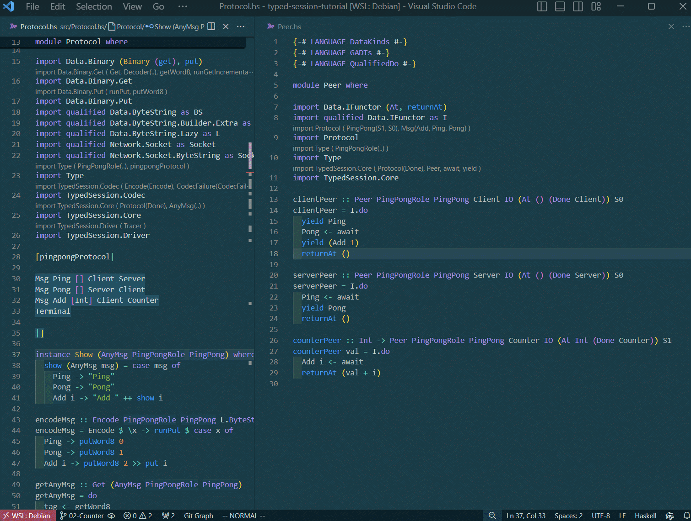
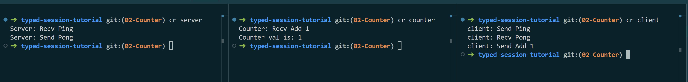

# 02-Counter

Continue the journey of typed-session. typed-session supports multi-role communication. In this chapter, I will add a new role, Counter. The code of Chapter 2 can be found [here](https://github.com/sdzx-1/typed-session-tutorial/tree/02-Counter).

First, modify the definition of PingPongRole in Type.hs to add Counter.
```diff
-data PingPongRole = Client | Server
+data PingPongRole = Client | Server | Counter
```
Then modify Protocol.hs and add a message to the protocol:
```diff
 Msg Ping [] Client Server
 Msg Pong [] Server Client
+Msg Add [Int] Client Counter
```
This message means: after the Client receives the Pong message, it sends an Add message to the Counter, and the Add message carries an Int parameter.
The location of the message here has strict semantics, and the type system will also check whether the communication statement meets the semantic requirements here.

New messages have been added, and the corresponding codecs also need to be modified:
```diff
 encodeMsg :: Encode PingPongRole PingPong L.ByteString
 encodeMsg = Encode $ \x -> runPut $ case x of
   Ping -> putWord8 0
   Pong -> putWord8 1
+  Add i -> putWord8 2 >> put i
 
 getAnyMsg :: Get (AnyMsg PingPongRole PingPong)
 getAnyMsg = do
@@ -48,6 +52,9 @@ getAnyMsg = do
   case tag of
     0 -> return $ AnyMsg Ping
     1 -> return $ AnyMsg Pong
+    2 -> do
+      i <- get
+      return $ AnyMsg (Add i)
     _ -> fail "Invalid message tag"
```
Next, you need to modify the code of the specific communication process in Peer.hs:

First modify clientPeer:
```diff
@@ -14,6 +14,7 @@ clientPeer :: Peer PingPongRole PingPong Client IO (At () (Done Client)) S0
 clientPeer = I.do
   yield Ping
   Pong <- await
+  yield (Add 1)
   returnAt ()
```

Then implement the counterPeer communication code:
```diff
+
+counterPeer :: Int -> Peer PingPongRole PingPong Counter IO (At Int (Done Counter)) S1
+counterPeer val = I.do
+  Add i <- await
+  returnAt (val + i)
```

Its initial state is S1. We can check the newly generated PingPong.prot file to find the initial state of Counter.
The content of the new PingPong.prot is as follows:
```
--------------Client------Server------Counter-----
  Ping []     Send (S0)   Recv (S0)        (S1)   
  Pong []     Recv (S2)   Send (S2)        (S1)   
  Add [Int]   Send (S1)        (End)  Recv (S1)   
  Terminal         (End)       (End)       (End)  
```

We noticed that the initial status of Client and Server did not change.

Next, we need to modify the Run.hs file to implement the startup code of Counter.

Modify the runTCPServer' function in Chapter 1 to a more general function:
```diff
-runTCPServer' :: Maybe HostName -> ServiceName -> IO ()
-runTCPServer' mhost port = withSocketsDo $ do
+runTCPServer'
+  :: Maybe HostName
+  -> ServiceName
+  -> String
+  -> SPingPongRole client
+  -> Peer PingPongRole PingPong server IO (At a (Done server)) s
+  -> IO a
+runTCPServer' mhost port name sclient peer = withSocketsDo $ do
   addr <- resolve
   E.bracket (open addr) close start
  where
@@ -75,10 +98,11 @@ runTCPServer' mhost port = withSocketsDo $ do
   start sock = do
     (client, _peer) <- accept sock
     let clientChannel = socketAsChannel client
-        sendMap = IntMap.fromList [(singToInt SClient, C.send clientChannel)]
+        sendMap = IntMap.fromList [(singToInt sclient, C.send clientChannel)]
     serverTvar <- newTVarIO IntMap.empty
-    let serverDriver = driverSimple (myTracer "server: ") encodeMsg sendMap serverTvar id
-    thid1 <- forkIO $ decodeLoop (myTracer "server: ") Nothing (Decode decodeMsg) clientChannel serverTvar
-    void $ runPeerWithDriver serverDriver serverPeer
+    let serverDriver = driverSimple (myTracer (name ++ ": ")) encodeMsg sendMap serverTvar id
+    thid1 <- forkIO $ decodeLoop (myTracer (name ++ ": ")) Nothing (Decode decodeMsg) clientChannel serverTvar
+    a <- runPeerWithDriver serverDriver peer
     killThread thid1
-    close client
\ No newline at end of file
+    close client
+    pure a
\ No newline at end of file
```

Implement runTCPServer using the new runTCPServer' function:
```diff
-runTCPServer = runTCPServer' Nothing "3000"
+runTCPServer = runTCPServer' Nothing "3000" "Server" SClient serverPeer
```

Implement runTCPCounter using the new runTCPServer' function:
```diff
+runTCPCounter :: IO ()
+runTCPCounter = do
+  val <- runTCPServer' Nothing "3001" "Counter" SClient (counterPeer 0)
+  putStrLn $ "Counter val is: " <> show val
```

Then you need to modify the Client startup code:
```diff
@@ -35,25 +37,46 @@ runTCPClient = withSocketsDo $ do
   E.bracket
     ( do
         serverSock <- getSocket "127.0.0.1" "3000"
-        pure serverSock
+        counterSock <- getSocket "127.0.0.1" "3001"
+        pure (serverSock, counterSock)
     )
-    (\a -> close a)
+    (\(a, b) -> close a >> close b)
     client
  where
-  client serverSock = do
+  client (serverSock, counterSock) = do
     clientTvar <- newTVarIO IntMap.empty
     let serverChannel = socketAsChannel serverSock
-        sendMap = IntMap.fromList [(singToInt SServer, C.send serverChannel)]
-        clientDriver = driverSimple (myTracer "client: ") encodeMsg sendMap clientTvar id
+        counterChannel = socketAsChannel counterSock
     thid1 <- forkIO $ decodeLoop (myTracer "client: ") Nothing (Decode decodeMsg) serverChannel clientTvar
+    thid2 <- forkIO $ decodeLoop (myTracer "client: ") Nothing (Decode decodeMsg) counterChannel clientTvar
+
+    let sendMap =
+          IntMap.fromList
+            [ (singToInt SServer, C.send serverChannel)
+            , (singToInt SCounter, C.send counterChannel)
+            ]
+        clientDriver = driverSimple (myTracer "client: ") encodeMsg sendMap clientTvar id
+
     void $ runPeerWithDriver clientDriver clientPeer
     killThread thid1
+    killThread thid2
```

The connection model in Chapter 1 is as follows:
```
Server <--> Client
```

The new connection model in this chapter is as follows:
```
Server <--> Client <--> Counter
```

The Client needs to communicate with both the Server and the Counter, and the Server and the Counter do not communicate with each other.

Finally, add a new running component in Cabal and add a new start file Counter.hs to the app folder:
```diff
+executable counter
+    import:           warnings
+    main-is:          Counter.hs
+    build-depends:
+        base ^>=4.20.0.0,
+        typed-session-tutorial
+    hs-source-dirs:   app
+    default-language: Haskell2010

--- /dev/null
+++ b/app/Counter.hs
@@ -0,0 +1,6 @@
+module Main (main) where
+
+import Run
+
+main :: IO ()
+main = runTCPCounter
```
-------------------------
typed-session can statically check whether the communication statements meet the requirements of the communication protocol:


When I adjust the position of `Msg Add [] Client Server`, the corresponding communication statement also needs to be adjusted. The type system accurately tells us the location of the error.

This is all the content of the code in Chapter 2. It doesn't contain much content. In the next part, I will explain the specific algorithm of the state machine, taking the protocol in this chapter as an example:
```
Msg Ping [] Client Server
Msg Pong [] Server Client
Msg Add [Int] Client Counter
Terminal
```

First, all communication states will be numbered.
Here, one line represents the state of Client, Server, and Counter before this message is sent.
```
         Client Server Counter
Ping     1      2      3
Pong     4      5      6
Add      7      8      9
Terminal End    End    End
```

`Msg Ping [] Client Server`

This means that the requirement to send the Ping message is (1 == 2).
Since Counter does not participate in this round of communication, its state should not change.
Therefore, the requirement (3 == 6) must be met.

For the same reason `Msg Pong [] Server Client` will produce (4 == 5) (6 == 9)

`Msg Add [Int] Client Counter` will produce (7 == 9) (8 == End)


Replacing the constraints above will produce the following result:
```
         Client Server Counter
Ping     1      1      3
Pong     4      4      3
Add      3      End    3
Terminal End    End    End
```

This is similar to the contents of the PingPnong.prot file:
```
--------------Client------Server------Counter-----
  Ping []     Send (S0)   Recv (S0)        (S1)   
  Pong []     Recv (S2)   Send (S2)        (S1)   
  Add [Int]   Send (S1)        (End)  Recv (S1)   
  Terminal         (End)       (End)       (End)  
```

The generation of the specific state machine is completed by the library [typed-session-state-algorithm](git@github.com:sdzx-1/typed-session-state-algorithm.git). The actual state generation also needs to consider the branches and loops.

-------------------------
You can use `cabal run server`, `cabal run counter` and `cabal run client` to run the program. The server and counter should be started before the client. The running results are as follows:


[Next Chapter 03-Loop](03-Loop.md)
