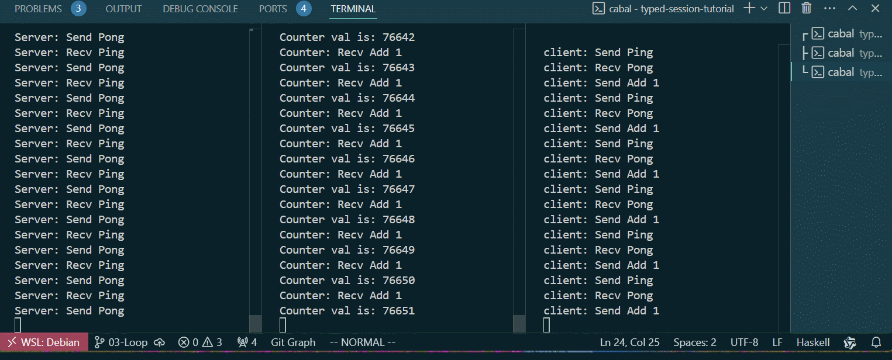

# 03-Loop

In the previous chapter, we implemented a simple three-role communication protocol. Its communication process is very simple and is executed only once. typed-session supports protocols with three structures: sequence, loop, and branch. In this chapter, loops will be introduced, which allows the protocol to run indefinitely. The concept of typed-session is that the structure of the protocol is the structure of the business, and the protocol itself guides the writing of the business. The code for Chapter 3 can be found here [https://github.com/sdzx-1/typed-session-tutorial/tree/03-Loop].


Let's modify Protocol.hs to introduce a loop:
```diff
@@ -27,10 +27,11 @@ import TypedSession.Driver
 
 [pingpongProtocol|
 
+Label 0
 Msg Ping [] Client Server
 Msg Pong [] Server Client
 Msg Add [Int] Client Counter
-Terminal
+Goto 0
 
 |]
 
```
Here, `Label 0` is used to add label 0, and `Goto 0` is used to jump to label 0. Labels can be added arbitrarily, but when `Goto i` is used, `i` must have been added in the previous protocol through `Label`, otherwise a compiler error will be generated: `Label Undefined: `.

As the protocol changes, the compilation will tell us all the places that need to be modified:


This is the demonstration of the concept of typed-session. Changes in the protocol guide changes in communication statements, and the type system tells you where to modify.

Let's run the program using `cabal run server`, `cabal run counter` and `cabal run client`. The server and counter should be started before the client. The running results are as follows:


The protocol here will run forever until you manually end the program. So can the protocol be looped a certain number of times and then stopped by itself? Of course it is possible, but this requires the content of the next chapter branch.

[Next Chapter 04-Branch](04-Branch.md)