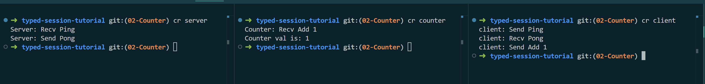

# 02-Counter

继续typed-session的旅程。typed-session支持多角色通信，这章中我将添加一个新角色Counter。第二章的代码可以在此[找到](https://github.com/sdzx-1/typed-session-tutorial/tree/02-Counter)。


首先修改Type.hs 中PingPongRole 的定义添加Counter。
```diff
-data PingPongRole = Client | Server
+data PingPongRole = Client | Server | Counter
```

然后修改Protocol.hs, 在协议中添加一条消息：
```diff
 Msg Ping [] Client Server
 Msg Pong [] Server Client
+Msg Add [Int] Client Counter
```
这条消息的意思是：在Client接收到Pong消息后，在向Counter发送一个Add消息，并且Add 消息携带一个Int参数。
这里消息放置的位置是有严格语义，并且类型系统也会检查通信语句是否满足这里的语义要求。

添加了新的消息，相对应的编解码也需要修改：
```diff
 encodeMsg :: Encode PingPongRole PingPong L.ByteString
 encodeMsg = Encode $ \x -> runPut $ case x of
   Ping -> putWord8 0
   Pong -> putWord8 1
+  Add i -> putWord8 2 >> put i
 
 getAnyMsg :: Get (AnyMsg PingPongRole PingPong)
 getAnyMsg = do
@@ -48,6 +52,9 @@ getAnyMsg = do
   case tag of
     0 -> return $ AnyMsg Ping
     1 -> return $ AnyMsg Pong
+    2 -> do
+      i <- get
+      return $ AnyMsg (Add i)
     _ -> fail "Invalid message tag"
```

接下来需要修改Peer.hs中具体的通信过程的代码：

首先修改clientPeer：
```diff
@@ -14,6 +14,7 @@ clientPeer :: Peer PingPongRole PingPong Client IO (At () (Done Client)) S0
 clientPeer = I.do
   yield Ping
   Pong <- await
+  yield (Add 1)
   returnAt ()
```

然后实现counterPeer的通信代码：
```diff
+
+counterPeer :: Int -> Peer PingPongRole PingPong Counter IO (At Int (Done Counter)) S1
+counterPeer val = I.do
+  Add i <- await
+  returnAt (val + i)
```
它的初始状态是S1，我们可以查看新生成PingPong.prot文件，可以找到Counter的初始状态。
新的 PingPong.prot 的内容如下： 
```
--------------Client------Server------Counter-----
  Ping []     Send (S0)   Recv (S0)        (S1)   
  Pong []     Recv (S2)   Send (S2)        (S1)   
  Add [Int]   Send (S1)        (End)  Recv (S1)   
  Terminal         (End)       (End)       (End)  
```
我们注意到，Client，Server的初始状态没有变化。

接下来来需要修改Run.hs文件，实现Counter的启动代码。

将第一章的runTCPServer'函数修改为一个更通用的函数：
```diff
-runTCPServer' :: Maybe HostName -> ServiceName -> IO ()
-runTCPServer' mhost port = withSocketsDo $ do
+runTCPServer'
+  :: Maybe HostName
+  -> ServiceName
+  -> String
+  -> SPingPongRole client
+  -> Peer PingPongRole PingPong server IO (At a (Done server)) s
+  -> IO a
+runTCPServer' mhost port name sclient peer = withSocketsDo $ do
   addr <- resolve
   E.bracket (open addr) close start
  where
@@ -75,10 +98,11 @@ runTCPServer' mhost port = withSocketsDo $ do
   start sock = do
     (client, _peer) <- accept sock
     let clientChannel = socketAsChannel client
-        sendMap = IntMap.fromList [(singToInt SClient, C.send clientChannel)]
+        sendMap = IntMap.fromList [(singToInt sclient, C.send clientChannel)]
     serverTvar <- newTVarIO IntMap.empty
-    let serverDriver = driverSimple (myTracer "server: ") encodeMsg sendMap serverTvar id
-    thid1 <- forkIO $ decodeLoop (myTracer "server: ") Nothing (Decode decodeMsg) clientChannel serverTvar
-    void $ runPeerWithDriver serverDriver serverPeer
+    let serverDriver = driverSimple (myTracer (name ++ ": ")) encodeMsg sendMap serverTvar id
+    thid1 <- forkIO $ decodeLoop (myTracer (name ++ ": ")) Nothing (Decode decodeMsg) clientChannel serverTvar
+    a <- runPeerWithDriver serverDriver peer
     killThread thid1
-    close client
\ No newline at end of file
+    close client
+    pure a
\ No newline at end of file
```
使用新的runTCPServer'函数实现runTCPServer：
```diff
-runTCPServer = runTCPServer' Nothing "3000"
+runTCPServer = runTCPServer' Nothing "3000" "Server" SClient serverPeer
```
使用新的runTCPServer'函数实现runTCPCounter：
```diff
+runTCPCounter :: IO ()
+runTCPCounter = do
+  val <- runTCPServer' Nothing "3001" "Counter" SClient (counterPeer 0)
+  putStrLn $ "Counter val is: " <> show val
```

然后需要修改Client的启动代码：
```diff
@@ -35,25 +37,46 @@ runTCPClient = withSocketsDo $ do
   E.bracket
     ( do
         serverSock <- getSocket "127.0.0.1" "3000"
-        pure serverSock
+        counterSock <- getSocket "127.0.0.1" "3001"
+        pure (serverSock, counterSock)
     )
-    (\a -> close a)
+    (\(a, b) -> close a >> close b)
     client
  where
-  client serverSock = do
+  client (serverSock, counterSock) = do
     clientTvar <- newTVarIO IntMap.empty
     let serverChannel = socketAsChannel serverSock
-        sendMap = IntMap.fromList [(singToInt SServer, C.send serverChannel)]
-        clientDriver = driverSimple (myTracer "client: ") encodeMsg sendMap clientTvar id
+        counterChannel = socketAsChannel counterSock
     thid1 <- forkIO $ decodeLoop (myTracer "client: ") Nothing (Decode decodeMsg) serverChannel clientTvar
+    thid2 <- forkIO $ decodeLoop (myTracer "client: ") Nothing (Decode decodeMsg) counterChannel clientTvar
+
+    let sendMap =
+          IntMap.fromList
+            [ (singToInt SServer, C.send serverChannel)
+            , (singToInt SCounter, C.send counterChannel)
+            ]
+        clientDriver = driverSimple (myTracer "client: ") encodeMsg sendMap clientTvar id
+
     void $ runPeerWithDriver clientDriver clientPeer
     killThread thid1
+    killThread thid2
```

在第一章中的连接模型如下：
```
Server <--> Client
```
在本章中新的连接模型如下：
```
Server <--> Client <--> Counter
```
Client 需要同时和Server 和Counter 通信，并且Server 与 Counter之间不相互通信。

最后在Cabal中添加新的运行组件，并app文件夹中添加新的开始文件Counter.hs：
```diff
+executable counter
+    import:           warnings
+    main-is:          Counter.hs
+    build-depends:
+        base ^>=4.20.0.0,
+        typed-session-tutorial
+    hs-source-dirs:   app
+    default-language: Haskell2010

--- /dev/null
+++ b/app/Counter.hs
@@ -0,0 +1,6 @@
+module Main (main) where
+
+import Run
+
+main :: IO ()
+main = runTCPCounter
```
-------------------------
typed-session 能静态检查通信语句是否符合通信协议的要求：

当我调整`Msg Add [] Client Server`的位置时对应通信语句也需要调整位置，类型系统精确的告诉了我们错误的位置。

这就是第二章代码的全部内容，它的内容并不多。我在接下来的部分将解释状态机的具体算法,以这章的协议为例：
```
Msg Ping [] Client Server
Msg Pong [] Server Client
Msg Add [Int] Client Counter
Terminal
```
首先将给所有通信的状态进行编号，
这里一行表示这条消息发送前Client， Server，Counter的状态。
```
         Client Server Counter
Ping     1      2      3
Pong     4      5      6
Add      7      8      9
Terminal End    End    End
```

`Msg Ping [] Client Server`
表示发送消息Ping 需要满足的要求是(1 == 2)，
同时因为Counter 不参与这轮通信所以它的状态不应该改变
因此需要满足要求(3 == 6)。

相同的理由`Msg Pong [] Server Client` 将产生 (4 == 5) (6 == 9)

`Msg Add [Int] Client Counter` 将产生 (7 == 9) (8 == End)

将上面产生的约束替换将得到下面的结果：
```
         Client Server Counter
Ping     1      1      3
Pong     4      4      3
Add      3      End    3
Terminal End    End    End
```
这与PingPnong.prot文件的内容相似：
```
--------------Client------Server------Counter-----
  Ping []     Send (S0)   Recv (S0)        (S1)   
  Pong []     Recv (S2)   Send (S2)        (S1)   
  Add [Int]   Send (S1)        (End)  Recv (S1)   
  Terminal         (End)       (End)       (End)  
```
具体状态机的生成是由库[typed-session-state-algorithm](git@github.com:sdzx-1/typed-session-state-algorithm.git)完成,实际的状态生成还需要考虑分支和循环的情况。

-------------------------
你可以使用`cabal run server`, `cabal run counter`和`cabal run client`来运行程序。server和counter应先于client启动。运行结果如下:
