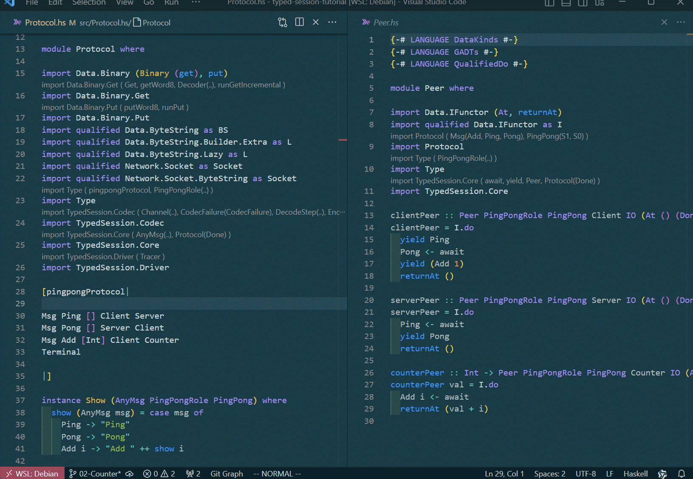

# 03-Loop

在上一章中，我们实现了一个简单的三个角色通信协议。它的通信过程非常简单，并且只执行一次。typed-session 支持具有顺序，循环，分支这三种结构的协议，在这章中将引入循环，这允许协议能无限运行下去。typed-session的理念是：协议的结构既是业务的结构，协议本身指导业务的编写。第三章的代码可以在此[找到](https://github.com/sdzx-1/typed-session-tutorial/tree/03-Loop)。


让我们修改Protocol.hs，引入循环：
```diff
@@ -27,10 +27,11 @@ import TypedSession.Driver
 
 [pingpongProtocol|
 
+Label 0
 Msg Ping [] Client Server
 Msg Pong [] Server Client
 Msg Add [Int] Client Counter
-Terminal
+Goto 0
 
 |]
 
```
这里使用`Label 0`表示添加标签0，使用`Goto 0`表示跳转到标签0。标签可以任意添加，但是`Goto i`时，`i` 必须已经在前面的协议中通过`Label`添加，否则将产生编译器错误：`Label Undefined: `。

随着协议的更改，编译将告诉我们所有需要修改的地方：


这就是typed-session理念的展示，协议的改变指导通信语句的改变，类型系统告诉你需要修改的地方。


让我们使用`cabal run server`, `cabal run counter`和`cabal run client`来运行程序。server和counter应先于client启动。运行结果如下:


这里的协议将永远运行下去，直到你手动结束程序。那么能否让协议循环一定次数，然后自己停止呢？这当然可以，只是这需要涉及下一章分支的内容了。