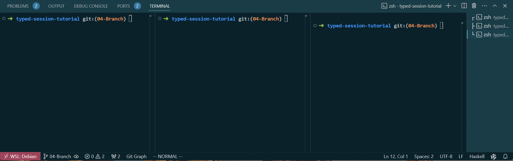

# 04-Branch

这章中我们将向协议添加分支，从而使得协议在循环一定次数后自动结束，让我们开始。
第四章的代码可以在此[找到](https://github.com/sdzx-1/typed-session-tutorial/tree/04-Branch)。

记得在第一章的时候我们在Type.hs中定义了一个类型：PingPongBranchSt，这正是为分支准备的。让我们先修改它：
```diff
diff --git a/src/Type.hs b/src/Type.hs
index 8c2c69f..3251853 100644
--- a/src/Type.hs
+++ b/src/Type.hs
@@ -9,7 +9,7 @@ import TypedSession.TH (protocol)
 data PingPongRole = Client | Server | Counter
   deriving (Show, Eq, Ord, Enum, Bounded)
 
-data PingPongBranchSt = PingPongBranchSt
+data PingPongBranchSt = Continue | Finish
   deriving (Show, Eq, Ord, Enum, Bounded)
 
 pingpongProtocol :: QuasiQuoter

```
这里添加了两个状态：Continue，Finish，分别表示继续循环和结束程序。

接下来修改Protocol.hs中协议的内容：
```diff
 [pingpongProtocol|
 
 Label 0
-Msg Ping [] Client Server
-Msg Pong [] Server Client
-Msg Add [Int] Client Counter
-Goto 0
-
+Branch Client ChoiceNextAction {
+  BranchSt Continue []
+    Msg Ping [] Client Server
+    Msg Pong [] Server Client
+    Msg Add [Int] Client Counter
+    Goto 0
+  BranchSt Finish []
+    Msg ServerStop [] Client Server
+    Msg CounterStop [] Client Counter
+    Terminal
+}
 |]
```
上一章中通信的消息都放入了Continue 分支。Finish 分支则包含结束的消息。

Branch 语法较为复杂，让我来详细解释。Branch 语法如下：
```
Branch Role ResultType {
  BranchSt St1 []
    ....
  BranchSt St2 []
    ....
  BranchSt St3 []
    ....
  ....
}
```
在多角色通信的过程中Branch的含义是：`Role`需要在运行时动态确定自己下一步的状态，这往往代表了函数的存在，ResultType则是是不确定状态的singleton 类型，St1 St2 St3...将生成它的构造器,下面是最终将生成的类型：
```Haskell
data ResultType :: Protocol -> Type where
  BranchSt_St1 :: ResultType (..)
  BranchSt_St2 :: ResultType (..)
  BranchSt_St3 :: ResultType (..)
  ....
```

对于我们的协议：
```
Branch Client ChoiceNextAction {
  BranchSt Continue []
    Msg Ping [] Client Server
    Msg Pong [] Server Client
    Msg Add [Int] Client Counter
    Goto 0
  BranchSt Finish []
    Msg ServerStop [] Client Server
    Msg CounterStop [] Client Counter
    Terminal
}
```

Branch 将在幕后生成下面的类型和函数：
```haskell
    data ChoiceNextAction (a_a6P8 :: PingPong)
      where
        BranchSt_Finish :: ChoiceNextAction ('S1 'Finish)
        BranchSt_Continue :: ChoiceNextAction ('S1 'Continue)

    type ChoiceNextActionFun (m_a6P9 :: Type -> Type) =
        Peer PingPongRole PingPong Client m_a6P9 ChoiceNextAction 'S0
```
让我们查看新的PingPong.prot文件
```
-------------------------------------Client--------------Server--------------Counter-------------
Label 0                                   (S0)                (S1 s)              (S2 s)         
  [Branch Client ChoiceNextAction]        (S0)                (S1 s)              (S2 s)         
  * BranchSt_Continue []             
  Ping []                            Send (S1 Continue)  Recv (S1 s)              (S2 s)         
    Pong []                          Recv (S3)           Send (S3)                (S2 s)         
    Add [Int]                        Send (S2 Continue)       (S1 s)         Recv (S2 s)         
    Goto 0                                (S0)                (S1 s)              (S2 s)         
  * BranchSt_Finish []               
  ServerStop []                      Send (S1 Finish)    Recv (S1 s)              (S2 s)         
    CounterStop []                   Send (S2 Finish)         (End)          Recv (S2 s)         
    Terminal                              (End)               (End)               (End)          

```
`ChoiceNextActionFun`代表了Client 将状态从`S0` 转换到不确定状态`S1 Finish`, `S1 Continue`的函数类型。因此让我们先实现这个函数：

```diff
+choice :: Int -> ChoiceNextActionFun IO
+choice i = do
+  if i == 100
+    then liftConstructor BranchSt_Finish
+    else liftConstructor BranchSt_Continue
```
这里的含义是当`i`等于100 时将状态转换为`S1 Finish` (`BranchSt_Finish :: ChoiceNextAction ('S1 'Finish)`), 
否则转换为`S1 Continue` (`BranchSt_Continue :: ChoiceNextAction ('S1 'Continue)`) 。需要注意的是，这里是类型的断点，这里需要动态运行的结果来确定接下来的状态，因此你需要自己保证这里的业务逻辑正确。

接下来修改clientPeer函数：
```diff
-clientPeer :: Peer PingPongRole PingPong Client IO (At () (Done Client)) S0
-clientPeer = I.do
-  yield Ping
-  Pong <- await
-  yield (Add 1)
-  clientPeer
+clientPeer :: Int -> Peer PingPongRole PingPong Client IO (At () (Done Client)) S0
+clientPeer i = I.do
+  choice i I.>>= \case
+    BranchSt_Continue -> I.do
+      yield Ping
+      Pong <- await
+      yield (Add 1)
+      clientPeer (i + 1)
+    BranchSt_Finish -> I.do
+      yield ServerStop
+      yield CounterStop
+      returnAt ()
```
clientPeer 加了一个参数用来记录循环次数，使用choice 函数来确定下一步的行为，同时将之前的通信逻辑放入BranchSt_Continue 分支中。在BranchSt_Finish 分支中处理通信结束逻辑：向Server 和Counter 分别发送ServerStop 和CounterStop消息，并结束程序。

修改serverPeer函数：
```diff
-serverPeer :: Peer PingPongRole PingPong Server IO (At () (Done Server)) S0
+serverPeer :: Peer PingPongRole PingPong Server IO (At () (Done Server)) (S1 s)
 serverPeer = I.do
-  Ping <- await
-  yield Pong
-  serverPeer
+  await I.>>= \case
+    Ping -> I.do
+      yield Pong
+      serverPeer
+    ServerStop -> returnAt ()
```
注意它的初始状态发生变化，同时他需要接受ServerStop消息。

修改counterPeer函数，与serverPeer类似：
```diff
-counterPeer :: Int -> Peer PingPongRole PingPong Counter IO (At Int (Done Counter)) S1
+counterPeer :: Int -> Peer PingPongRole PingPong Counter IO (At Int (Done Server)) (S2 s)
 counterPeer val = I.do
   liftm $ putStrLn $ "Counter val is: " ++ show val
-  Add i <- await
-  counterPeer (val + i)
+  await I.>>= \case
+    Add i -> counterPeer (val + i)
+    CounterStop -> returnAt val
```
初始状态发生变化，同时需要接受CounterStop消息。

最后修改clientPeer的启动函数：
```diff
--- a/src/Run.hs
+++ b/src/Run.hs
@@ -57,7 +57,7 @@ runTCPClient = withSocketsDo $ do
             ]
         clientDriver = driverSimple (myTracer "client: ") encodeMsg sendMap clientTvar id
 
-    void $ runPeerWithDriver clientDriver clientPeer
+    void $ runPeerWithDriver clientDriver (clientPeer 0)
     killThread thid1
     killThread thid2
 
```

让我们使用`cabal run server`, `cabal run counter`和`cabal run client`来运行程序。server和counter应先于client启动。运行结果如下:


结果完美符合我们的预期。

接下来我将介绍Branch 对多角色通信的深刻影响。
使用Branch 表示在这个时刻，某一角色A需要动态确定它自己接下来的状态。于此同时，其它角色都进入了不确定状态，它们都需要等待A发送的消息来确定自己的状态。对A以外的角色来说，在不确定自己状态下是不能发送任何消息，同时也不能进入其它Branch 状态。因此对A来说，在Branch的每个分支的第一条消息一定都是由A发给其它角色的。当然我们的状态生成器会检查这些条件是否满足。我们使用变量`s`来表现角色处于不确定状态。
```
-------------------------------------Client--------------Server--------------Counter-------------
Label 0                                   (S0)                (S1 s)              (S2 s)         
  [Branch Client ChoiceNextAction]        (S0)                (S1 s)              (S2 s)         
  * BranchSt_Continue []             
  Ping []                            Send (S1 Continue)  Recv (S1 s)              (S2 s)         
    Pong []                          Recv (S3)           Send (S3)                (S2 s)         
    Add [Int]                        Send (S2 Continue)       (S1 s)         Recv (S2 s)         
    Goto 0                                (S0)                (S1 s)              (S2 s)         
  * BranchSt_Finish []               
  ServerStop []                      Send (S1 Finish)    Recv (S1 s)              (S2 s)         
    CounterStop []                   Send (S2 Finish)         (End)          Recv (S2 s)         
    Terminal                              (End)               (End)               (End)          

```
Branch 也会对Terminal产生影响，在任何分支中使用Terminal，都要求所有角色都处于确定状态。以这章的协议为例，如果不向Counter 发送CounterStop 消息，那么Counter 就会一直等待，但同时Client，Server已经停止，它们不会再向Counter 发送任何消息了。这将造成Counter 永远等待。状态生成器也会检查这样的错误是否发生。

最后Branch 的存在使得循环的设计使用了Label和Goto的组合。