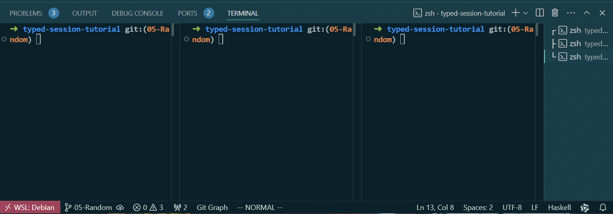

# 05-Random

第五章的代码可以在此[找到](https://github.com/sdzx-1/typed-session-tutorial/tree/05-Random)。

本章中我们尝试添加一些业务而不仅仅是互相发消息。我们的想法是让Client随机产生0~100的数值，通过Add 消息将值发送给Counter，让Counter累加这些值。同时Client自己也累加这些值。最后让Client和Counter都输出累加结果。

本章不需要修改通信协议，仅在通信语句中添加业务。

首先添加random依赖：
```diff
--- a/typed-session-tutorial.cabal
+++ b/typed-session-tutorial.cabal
@@ -78,6 +78,7 @@ library
                     , bytestring
                     , binary
                     , containers
+                    , random
 
     -- Directories containing source files.
     hs-source-dirs:   src
```

counterPeer函数符合累加的语义不需要修改，因此仅需要修改clientPeer函数:
```diff
-clientPeer :: Int -> Peer PingPongRole PingPong Client IO (At () (Done Client)) S0
-clientPeer i = I.do
+clientPeer
+  :: Int
+  -> IORef Int
+  -> Peer PingPongRole PingPong Client IO (At Int (Done Client)) S0
+clientPeer i valRef = I.do
   choice i I.>>= \case
     BranchSt_Continue -> I.do
       yield Ping
       Pong <- await
-      yield (Add 1)
-      clientPeer (i + 1)
+      At randVal <- liftm $ do
+        rval <- randomRIO @Int (0, 100)
+        modifyIORef valRef (+ rval)
+        pure rval
+      yield (Add randVal)
+      clientPeer (i + 1) valRef
     BranchSt_Finish -> I.do
       yield ServerStop
       yield CounterStop
-      returnAt ()
+      At val <- liftm $ readIORef valRef
+      returnAt val
```
添加了一个IORef来保存累加值，使用IORef主要是为了展示如何在通信语句中插入普通的IO操作。
这里的IO可以是其它任何的`Monad m`，这取决于你的业务需求额。使用liftm 可以将普通的IO操作转换为Peer。liftm 不改变协议的状态，因此你可以在任何地方使用liftm 将内部的 m(这里是IO) 变成Peer。

liftm 的定义如下：
```haskell
{- |
Lift any m to Peer role' ps r m, which is an application of LiftM.
Note that the state of `ts` has not changed.
-}
liftm :: (Functor m) => m a -> Peer role' ps r m (At a ts) ts
liftm m = LiftM (returnAt <$> m)
```

注意，clientPeer 最终将返回累加的结果,因此需要修改它的启动函数,打印最终的结果：
```diff
index a19503a..c465bce 100644
--- a/src/Run.hs
+++ b/src/Run.hs
@@ -9,6 +9,7 @@ import qualified Control.Exception as E
 import Control.Monad (void)
 import Control.Monad.Class.MonadFork (forkIO, killThread)
 import Data.IFunctor (At)
+import Data.IORef
 import qualified Data.IntMap as IntMap
 import Network.Socket
 import Peer
@@ -57,9 +58,11 @@ runTCPClient = withSocketsDo $ do
             ]
         clientDriver = driverSimple (myTracer "client: ") encodeMsg sendMap clientTvar id
 
-    void $ runPeerWithDriver clientDriver (clientPeer 0)
+    valRef <- newIORef 0
+    res <- runPeerWithDriver clientDriver (clientPeer 0 valRef)
     killThread thid1
     killThread thid2
+    putStrLn $ "Client val is: " <> show res
 
 runTCPServer :: IO ()
 runTCPServer = runTCPServer' Nothing "3000" "Server" SClient serverPeer
```


让我们使用`cabal run server`, `cabal run counter`和`cabal run client`来运行程序。server和counter应先于client启动。运行结果如下:


client 和 counter 输出的累加结果相同，非常完美。


[下一章 06-Check](06-Check.md)