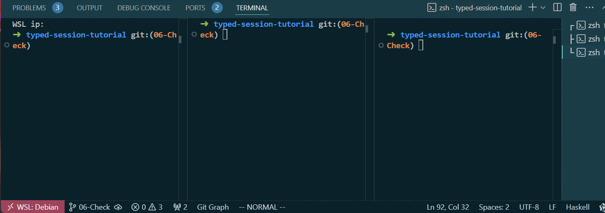

# 06-Check
第六章的代码可以在此[找到](https://github.com/sdzx-1/typed-session-tutorial/tree/06-Check)。

现在让我们重新看看到目前为止的协议：
```
[pingpongProtocol|

Label 0
Branch Client ChoiceNextAction {
  BranchSt Continue []
    Msg Ping [] Client Server
    Msg Pong [] Server Client
    Msg Add [Int] Client Counter
    Goto 0
  BranchSt Finish []
    Msg ServerStop [] Client Server
    Msg CounterStop [] Client Counter
    Terminal
}
|]
```
注意到我们的协议中，Client 向 Counter 循环发送Add 消息，让Counter 累加值，但是Counter 从未向Client 发送任何消息。

因此Client 并不知道Counter 是否正确完成了累加的工作。

当然我们可以要求Counter 每次累加完成后向Client 发送一个消息告知Clinet 累加的结果，但这将增加一次通信，同时也让Client-Counter间几乎异步的通信，变成了同步通信（Client 必须等待Counter 的响应），这将极大影响它们间数据传输的效率。

因此我们在这里使用新的思路：

Client 周期性的向Counter 发送CheckVal 消息，CheckVal 携带Client 目前的累加值，Counter 收到CheckVal 消息后检查它携带的值与自己累加的值是否相等。

如果相等那么Counter向Client 返回CheckSuccessed 消息，并继续等待下一个消息。

如果不相等，那么Counter向Client 返回CheckFailed 消息，CheckFaild 消息包含错误的原因，然后Counter 结束通信。

同时Client 收到CheckFailed消息后将向Server 发送CheckErrorHappened 消息，同时Client 结束通信。Server 在收到CheckErrorHappened 消息后结束通信。

针对上述想法，我们开始修改代码。

首先修改Type.hs文件的PingPongBranchSt：
```diff
--- a/src/Type.hs
+++ b/src/Type.hs
@@ -9,7 +9,7 @@ import TypedSession.TH (protocol)
 data PingPongRole = Client | Server | Counter
   deriving (Show, Eq, Ord, Enum, Bounded)
 
-data PingPongBranchSt = Continue | Finish
+data PingPongBranchSt = Continue | Finish | Check | Successed | Failed
   deriving (Show, Eq, Ord, Enum, Bounded)
 
 pingpongProtocol :: QuasiQuoter
```
它添加了三个状态：Check、Successed、Failed。

然后修改Protocol.hs文件：
首先修改协议
```diff
--- a/src/Protocol.hs
+++ b/src/Protocol.hs
@@ -38,6 +38,17 @@ Branch Client ChoiceNextAction {
     Msg ServerStop [] Client Server
     Msg CounterStop [] Client Counter
     Terminal
+  BranchSt Check []
+    Msg CheckVal [Int] Client Counter
+    Branch Counter CheckResult {
+      BranchSt Successed []
+        Msg CheckSuccessed [] Counter Client
+        Goto 0
+      BranchSt Failed []
+        Msg CheckFailed [String] Counter Client
+        Msg CheckErrorHappened [String] Client Server
+        Terminal
+    }
 }
 |]
```
在Client ChoiceNextAction 中添加了BranchSt Check，它的含义与上述的相同，这里不再重复。
添加了新的的消息，需要更新编解码：
```diff
index 20296db..7970584 100644
 instance Show (AnyMsg PingPongRole PingPong) where
@@ -47,6 +58,10 @@ instance Show (AnyMsg PingPongRole PingPong) where
     Add i -> "Add " <> show i
     ServerStop -> "ServerStop"
     CounterStop -> "CounterStop"
+    CheckVal i -> "CheckVal " <> show i
+    CheckSuccessed -> "CheckSuccessed"
+    CheckFailed st -> "CheckFailed " <> st
+    CheckErrorHappened st -> "CheckErrorHappened" <> st
 
 encodeMsg :: Encode PingPongRole PingPong L.ByteString
 encodeMsg = Encode $ \x -> runPut $ case x of
@@ -55,6 +70,10 @@ encodeMsg = Encode $ \x -> runPut $ case x of
   Add i -> putWord8 2 >> put i
   ServerStop -> putWord8 3
   CounterStop -> putWord8 4
+  CheckVal i -> putWord8 5 >> put i
+  CheckSuccessed -> putWord8 6
+  CheckFailed st -> putWord8 7 >> put st
+  CheckErrorHappened st -> putWord8 8 >> put st
 
 getAnyMsg :: Get (AnyMsg PingPongRole PingPong)
 getAnyMsg = do
@@ -67,6 +86,16 @@ getAnyMsg = do
       return $ AnyMsg $ Add i
     3 -> return $ AnyMsg ServerStop
     4 -> return $ AnyMsg CounterStop
+    5 -> do
+      i <- get
+      return $ AnyMsg $ CheckVal i
+    6 -> return $ AnyMsg CheckSuccessed
+    7 -> do
+      st <- get
+      return $ AnyMsg (CheckFailed st)
+    8 -> do
+      st <- get
+      return $ AnyMsg (CheckErrorHappened st)
     _ -> fail "Invalid message tag"
 
```

接下来需要修改Peer.hs文件中具体的通信代码了。
首先是choice函数:
```diff
 {-# LANGUAGE LambdaCase #-}
+{-# LANGUAGE MultiWayIf #-}
 {-# LANGUAGE QualifiedDo #-}

 choice :: Int -> ChoiceNextActionFun IO
 choice i = do
-  if i == 100
-    then liftConstructor BranchSt_Finish
-    else liftConstructor BranchSt_Continue
+  if
+    | i == 101 -> liftConstructor BranchSt_Finish
+    | i == 100 -> liftConstructor BranchSt_Check
+    | i `mod` 10 == 0 -> liftConstructor BranchSt_Check
+    | otherwise -> liftConstructor BranchSt_Continue
```
我们每循环10此就检查一次，之前是i == 100 就直接结束，但是我们想在结束前先检查一下，因此i == 100 时也检查一次，当i == 101 时结束。这是一个技巧，当我们想在结束前先检查一下可以这么做。

接下来修改clientPeer 函数：
```diff
 clientPeer
   :: Int
   -> IORef Int
-  -> Peer PingPongRole PingPong Client IO (At Int (Done Client)) S0
+  -> Peer PingPongRole PingPong Client IO (At (Either String Int) (Done Client)) S0
 clientPeer i valRef = I.do
   choice i I.>>= \case
     BranchSt_Continue -> I.do
@@ -39,19 +42,51 @@ clientPeer i valRef = I.do
       yield ServerStop
       yield CounterStop
       At val <- liftm $ readIORef valRef
-      returnAt val
+      returnAt (Right val)
+    BranchSt_Check -> I.do
+      At val <- liftm $ readIORef valRef
+      yield (CheckVal val)
+      await I.>>= \case
+        CheckSuccessed -> clientPeer (i + 1) valRef
+        CheckFailed st -> I.do
+          yield (CheckErrorHappened st)
+          returnAt (Left st)
```
由于可能检查失败，因此输出类型变成(Either String Int), 其它部分就是前面思路的直接翻译了。

接下来修改serverPeer 函数：
```diff

-serverPeer :: Peer PingPongRole PingPong Server IO (At () (Done Server)) (S1 s)
+serverPeer :: Peer PingPongRole PingPong Server IO (At (Either String ()) (Done Server)) (S1 s)
 serverPeer = I.do
   await I.>>= \case
     Ping -> I.do
       yield Pong
       serverPeer
-    ServerStop -> returnAt ()
+    ServerStop -> returnAt (Right ())
+    CheckErrorHappened st -> returnAt (Left st)
```
由于可能检查失败，因此输出类型变成(Either String ())。

同时需要修改serverPeer 的启动代码,打印输出结果：
```diff
+++ b/src/Run.hs
@@ -65,7 +65,9 @@ runTCPClient = withSocketsDo $ do
     putStrLn $ "Client val is: " <> show res
 
 runTCPServer :: IO ()
-runTCPServer = runTCPServer' Nothing "3000" "Server" SClient serverPeer
+runTCPServer = do
+  val <- runTCPServer' Nothing "3000" "Server" SClient serverPeer
+  putStrLn $ "Server val is: " <> show val
```

接下来实现checkFun 函数, Counter使用它动态确定接下来的状态：
```diff
+checkFun :: Int -> Int -> CheckResultFun IO
+checkFun val ci =
+  if val == ci
+    then liftConstructor BranchSt_Successed
+    else liftConstructor BranchSt_Failed
```


最后修改counterPeer 函数：
```diff
-counterPeer :: Int -> Peer PingPongRole PingPong Counter IO (At Int (Done Server)) (S2 s)
+counterPeer :: Int -> Peer PingPongRole PingPong Counter IO (At (Either String Int) (Done Server)) (S2 s)
 counterPeer val = I.do
   liftm $ putStrLn $ "Counter val is: " ++ show val
   await I.>>= \case
-    Add i -> counterPeer (val + i)
-    CounterStop -> returnAt val
+    Add i -> I.do
+      At rval <- liftm $ randomRIO @Int (0, 1000)
+      -- 0.995^100 ~= 0.6
+      let nval = val + if rval < 995 then i else (i - 1)
+      counterPeer nval
+    CounterStop -> returnAt (Right val)
+    CheckVal ci -> I.do
+      checkFun val ci I.>>= \case
+        BranchSt_Successed -> I.do
+          yield CheckSuccessed
+          counterPeer val
+        BranchSt_Failed -> I.do
+          let reason =
+                "Check failed, now value is "
+                  <> show val
+                  <> ", check value is "
+                  <> show ci
+          yield (CheckFailed reason)
+          returnAt (Left reason)
```

由于可能检查失败，因此输出类型变成(Either String Int)。为了让示例更有趣，我们让Counter 累加的值有5/1000的概率减小1，这样每次累加的值有可能不对从而触发检查失败的分支。注意这里checkFun 函数的使用，其它部分就是前面思路的直接翻译了。


让我们使用`cabal run server`, `cabal run counter`和`cabal run client`来运行程序。server和counter应先于client启动。运行结果如下:

现在结果有一定的概率会失败，失败时每个角色都将打印失败的原因。

纵观现在的协议代码：
```haskell
[pingpongProtocol|

Label 0
Branch Client ChoiceNextAction {
  BranchSt Continue []
    Msg Ping [] Client Server
    Msg Pong [] Server Client
    Msg Add [Int] Client Counter
    Goto 0
  BranchSt Finish []
    Msg ServerStop [] Client Server
    Msg CounterStop [] Client Counter
    Terminal
  BranchSt Check []
    Msg CheckVal [Int] Client Counter
    Branch Counter CheckResult {
      BranchSt Successed []
        Msg CheckSuccessed [] Counter Client
        Goto 0
      BranchSt Failed []
        Msg CheckFailed [String] Counter Client
        Msg CheckErrorHappened [String] Client Server
        Terminal
    }
}
|]
```
它有一定的复杂度，typed-session + hls 允许我们增量，交互式的开发它。这极大减少了我们的心智负担，同时这也意味着我们可以处理更加复杂的协议。