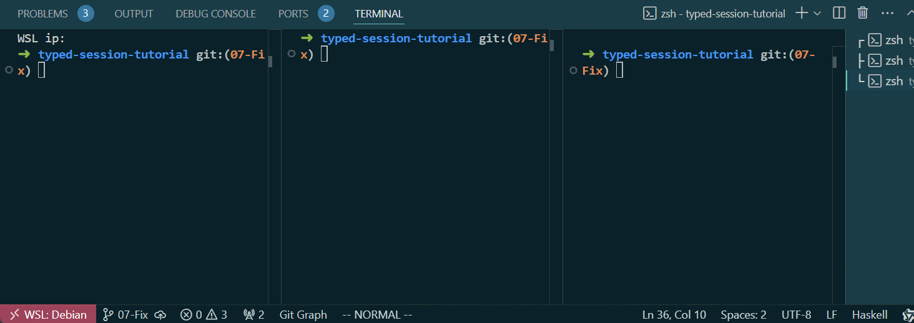

# 07-Fix
第七章的代码可以在此[找到](https://github.com/sdzx-1/typed-session-tutorial/tree/07-Fix)。

在上一章我们添加了Client-Counter之间周期性检查的逻辑，检查失败将直接导致协议终止，所有角色最终都将因此终止。

在这章中如果Counter 检查失败，Client 将会通过Fix 消息把新的值重新发给它，Counter 收到Fix 消息后将更新累加值，并返回FixFinish 消息。使用这中方式修复错误，同时这个过程中并不涉及与Server 的通信。

这时候细心的读者可能会奇怪：CheckVal 不是包含累加值吗，检查出错时直接用它更新不就行了吗？这是因为这仅仅是个例子，实际代码中检查所携带的信息很少，而修复则需要携带更多的信息，它们不太可能一样。

让我们开始修改协议：
```diff
--- a/src/Protocol.hs
+++ b/src/Protocol.hs
@@ -46,8 +46,9 @@ Branch Client ChoiceNextAction {
         Goto 0
       BranchSt Failed []
         Msg CheckFailed [String] Counter Client
-        Msg CheckErrorHappened [String] Client Server
-        Terminal
+        Msg Fix [Int] Client Counter
+        Msg FixFinish [] Counter Client
+        Goto 0
     }
 }
 |]
```
修改对应的编解码：
```diff
index 7970584..23f3d9e 100644
@@ -61,7 +62,8 @@ instance Show (AnyMsg PingPongRole PingPong) where
     CheckVal i -> "CheckVal " <> show i
     CheckSuccessed -> "CheckSuccessed"
     CheckFailed st -> "CheckFailed " <> st
-    CheckErrorHappened st -> "CheckErrorHappened" <> st
+    Fix i -> "Fix val " <> show i
+    FixFinish -> "FixFinish"
 
 encodeMsg :: Encode PingPongRole PingPong L.ByteString
 encodeMsg = Encode $ \x -> runPut $ case x of
@@ -73,7 +75,8 @@ encodeMsg = Encode $ \x -> runPut $ case x of
   CheckVal i -> putWord8 5 >> put i
   CheckSuccessed -> putWord8 6
   CheckFailed st -> putWord8 7 >> put st
-  CheckErrorHappened st -> putWord8 8 >> put st
+  Fix st -> putWord8 8 >> put st
+  FixFinish -> putWord8 9
 
 getAnyMsg :: Get (AnyMsg PingPongRole PingPong)
 getAnyMsg = do
@@ -95,7 +98,8 @@ getAnyMsg = do
       return $ AnyMsg (CheckFailed st)
     8 -> do
       st <- get
-      return $ AnyMsg (CheckErrorHappened st)
+      return $ AnyMsg (Fix st)
+    9 -> return $ AnyMsg FixFinish
     _ -> fail "Invalid message tag"
```

修改clientPeer函数：
```diff
@@ -48,9 +48,11 @@ clientPeer i valRef = I.do
       yield (CheckVal val)
       await I.>>= \case
         CheckSuccessed -> clientPeer (i + 1) valRef
-        CheckFailed st -> I.do
-          yield (CheckErrorHappened st)
-          returnAt (Left st)
+        (CheckFailed st) -> I.do
+          liftm $ putStrLn st
+          yield (Fix val)
+          FixFinish <- await
+          clientPeer i valRef
```
修改serverPeer函数：
```diff
 serverPeer :: Peer PingPongRole PingPong Server IO (At (Either String ()) (Done Server)) (S1 s)
 serverPeer = I.do
@@ -59,7 +61,6 @@ serverPeer = I.do
       yield Pong
       serverPeer
     ServerStop -> returnAt (Right ())
-    CheckErrorHappened st -> returnAt (Left st)
```

修改counterPeer函数：
```diff
 checkFun :: Int -> Int -> CheckResultFun IO
 checkFun val ci =
@@ -89,4 +90,6 @@ counterPeer val = I.do
                   <> ", check value is "
                   <> show ci
           yield (CheckFailed reason)
-          returnAt (Left reason)
+          (Fix newVal) <- await
+          yield FixFinish
+          counterPeer newVal
```

让我们使用`cabal run server`, `cabal run counter`和`cabal run client`来运行程序。server和counter应先于client启动。运行结果如下:
